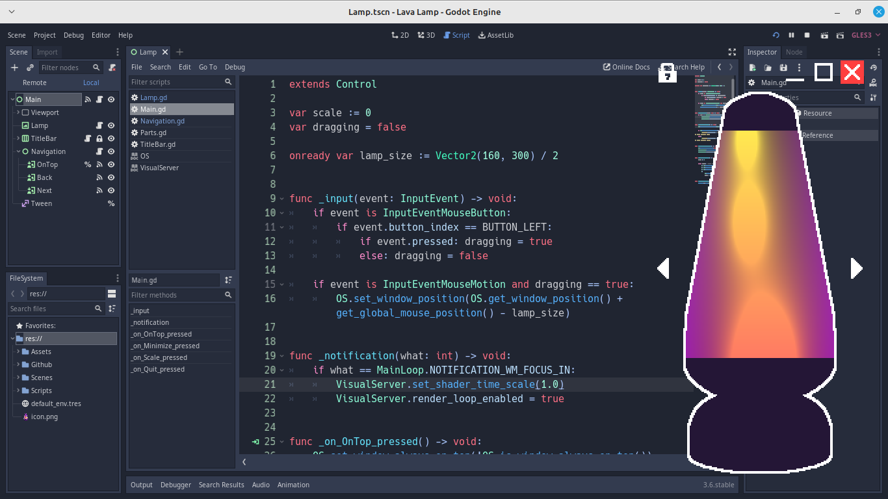

# Lava Lamp
Simple lava lamp to spice up your desktop

## Features
- Multiple instances don't affect each other. Spawn as much lamps as you like!
- Choose from 4 different skins.
- Change your lamp's size to your liking.
- Set your lamp to always be on top of other windows or not.
- Shader `TIME` and general rendering stops when minimized (see [VisualServer](https://docs.godotengine.org/en/3.6/classes/class_visualserver.html)).
- Outline for visual feedback when being hovered or is active.

# Preview
## Default size

| In Godot's Editor                   | On Mint Desktop                     |
| ----------------------------------- | ----------------------------------- |
|          |          |

## Large scale and options

| In Godot's Editor                   | On VSCodium with various instances  |
| ----------------------------------- | ----------------------------------- |
|          |          |

## Changes
- Added a *title bar* for *minimize*, *scale*, and *quit buttons*.
- Added an *'always on top'* toggle button.
- Added splash and icons.
- Fixed button arrangement bugs.
- Each skin has its own parameters for shader.

## To-do Features
- [x] Window sizes - preserve window's scale on size change
- [x] Skin options - add more textures to choose from
- [ ] Lava options - change how the lava looks via its shader
- [x] Top persists - 'always on top' window toggle option

## Documentation
- `_notification(what)` - notifies some changes to the program. `what` defines the kind of activity.
```gdscript
func _notification(what: int) -> void:
	if what == MainLoop.NOTIFICATION_WM_FOCUS_IN:
		VisualServer.set_shader_time_scale(1.0)
		VisualServer.render_loop_enabled = true
```
Let's say the user minimized the app. Once they try to maximize it again either by `Alt + Tab` command or other means, it notifies that it just gained its focus. In this example right after the notification, it just tells the `VisualServer` to continue the time scale of shaders, as well as continue all the visible renders.

# Credits
- I used [Dan3008's 2d lava lamp shader](https://godotshaders.com/shader/2d-lava-lamp/) and converted it for Godot 3 use. It's under the [CC0 license](https://creativecommons.org/public-domain/cc0/).
- This also uses [juulpower's 2D outline/inline, configured for sprite sheets](https://godotshaders.com/shader/2d-outline-inline-configured-for-sprite-sheets/) which is also under the [CC0 license](https://creativecommons.org/public-domain/cc0/).
